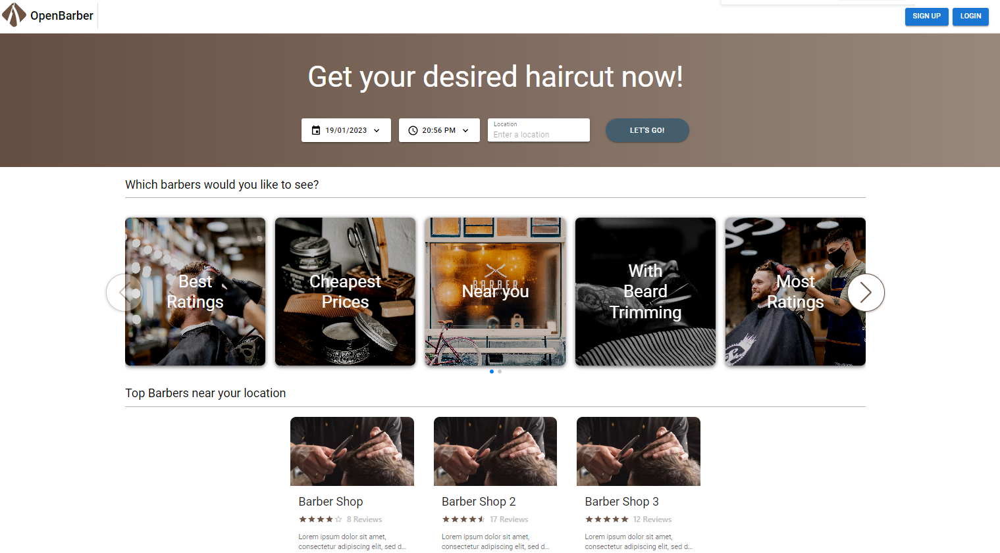
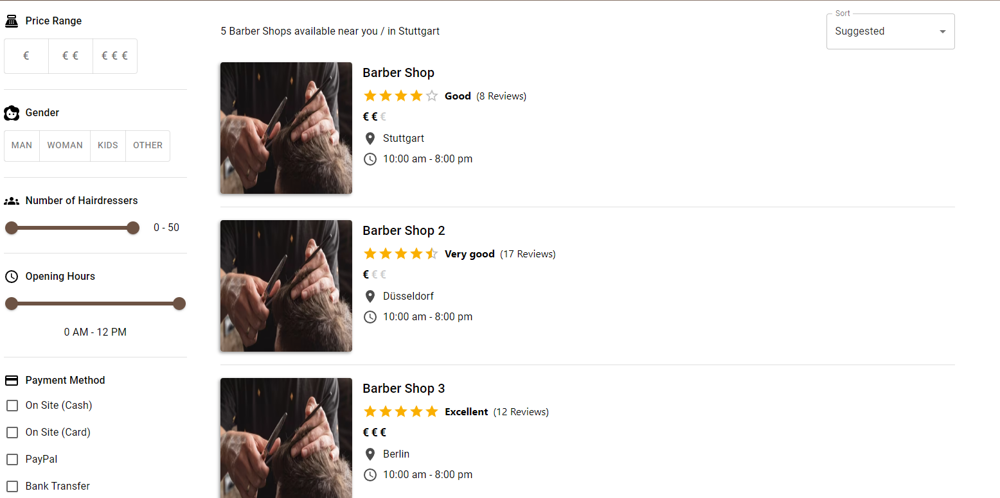
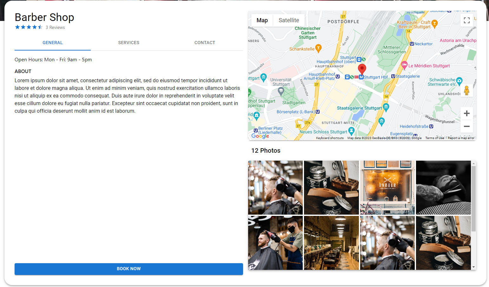
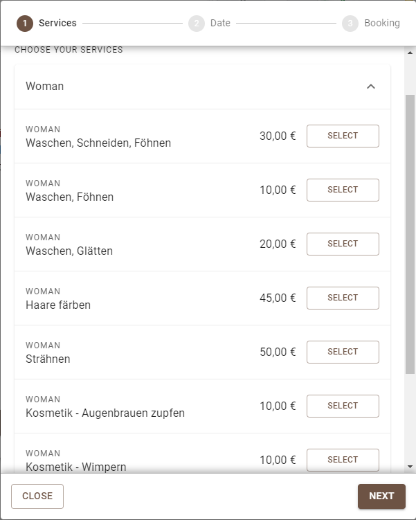

# OpenBarber

**OpenBarber** is a full-stack barber shop booking platform. Customers can discover barber shops near them, book appointments, and leave reviews. Shop owners can manage their profile, services, employees, and appointments through a dedicated scheduler.

---

## Tech Stack

| Layer | Technology |
|---|---|
| Frontend | React 18, TypeScript, Vite, MUI v5 |
| Backend | Java 17, Spring Boot, Spring Security (JWT) |
| Database | PostgreSQL 16 |
| Containerization | Docker, Docker Compose |

---

## Features

### For Customers
- 🔍 Search barber shops by location with radius filter
- 📅 Book appointments (guest or logged-in)
- ⭐ Rate and review shops
- 👤 Manage profile and view past/upcoming appointments
- 🌍 i18n support: English, German, Japanese

### For Shop Owners
- 🏪 Manage shop profile (opening hours, days, services, photos)
- 💈 Manage employees and their schedules
- 📆 Full appointment scheduler (day/week view, group by hairdresser)
- 📊 View and manage all bookings

### Filter & Search
- Filter by: minimum rating, opening days, opening hours, target audience, number of hairdressers, price range, payment methods, drinks
- All filtering is done server-side with proper pagination

---

## Getting Started

### Prerequisites
- Docker & Docker Compose

### Run with Docker

```bash
docker-compose up --build
```

| Service | URL |
|---|---|
| Frontend | http://localhost:80 |
| Backend API | http://localhost:8080 |

### Run locally (development)

**Backend** (requires Java 17):
```bash
cd Backend
./mvnw spring-boot:run
```

**Frontend** (requires Node 18+):
```bash
cd Frontend
npm install
npm start        # http://localhost:3000
```

---

## Seed Data

The backend automatically seeds sample data on first startup (`data.sql`):
- Sample barbershops, employees, services, appointments and reviews

**Seed login password:** `OpenBarber123!`

---

## Environment

The backend requires a `.env` file at `Backend/src/main/resources/.env`:

```env
SPRING_DATASOURCE_PASSWORD=admin
JWT_SECRET=your-secret
GOOGLE_CLIENT_ID=your-google-client-id
# ... other keys
```

---

## Project Structure

```
openbarber/
├── Frontend/         # React + Vite app
│   ├── src/
│   │   ├── components/
│   │   ├── pages/
│   │   ├── api/
│   │   ├── context/
│   │   ├── reducers/
│   │   └── css/      # SCSS stylesheets
│   └── Dockerfile
├── Backend/          # Spring Boot app
│   ├── src/main/java/
│   │   └── .../
│   │       ├── controller/
│   │       ├── service/
│   │       ├── model/
│   │       ├── repository/
│   │       └── specification/
│   └── Dockerfile
├── docker-compose.yml
└── README.md
```

---

## Screenshots





